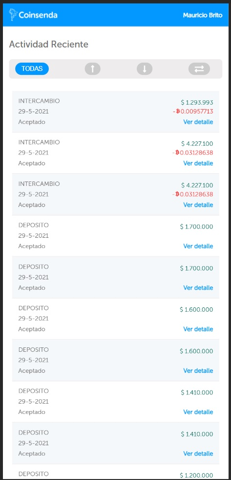
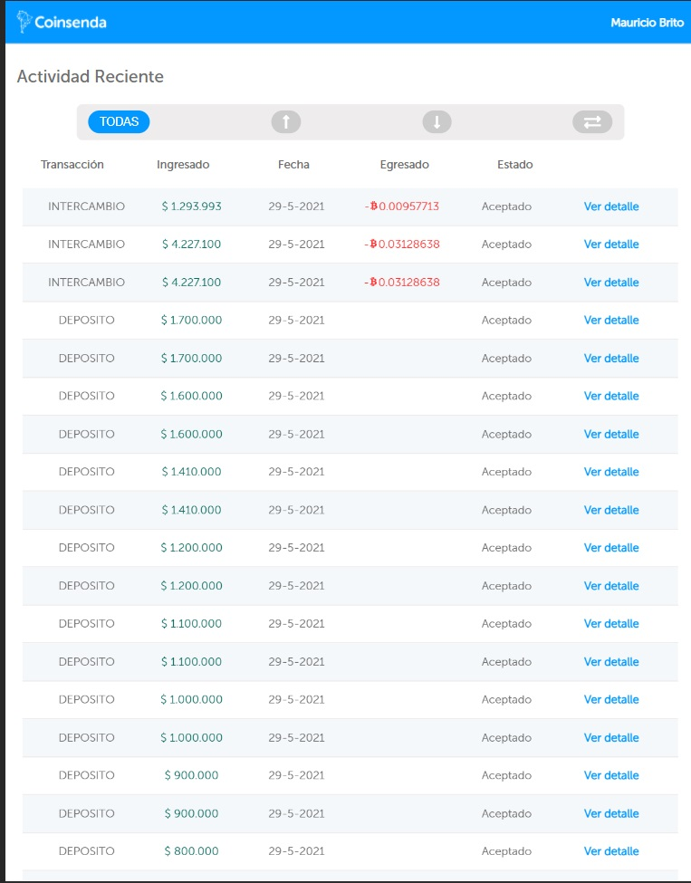

# Coinsenda Technical Test

---

### Tabla de contenido

- [Descripción](#descripcion)
- [Como instalar](#como-instalar)
- [Autor](#autor)

---

## Descripción

Aplicacion que simula la lista de registro de compra y venta de bitcoins.

Tome en cuenta el perfomance para evitar el re rendirazado de los registros y una vez al filtrar no volvieran a pintar de nuevos los registros ya en pantalla.

Aplique el lazy loading y code spliting agregando solo las vistas solo cuando iban a ser necesarias.

Use el intersection observer para no cargar to el listado de registros al momento visualizarlos sino que fueran cargando a medida que aparecian en pantalla.

Por ultimo para medir el perfomance de la aplicación use las metricas de la extensión de Lighthouse.

[LightHouse](./src/assets/metricas.pdf)

#### Tecnologías

- React.js
- Styled Components
- Redux
- React Router Dom
- Intersection Observer

[Back To The Top](#netflix-clone-app)

---

## Como Instalar

### Instalacion

`npm install`

### Correr Proyecto

`npm run start`

### Debe tener un JWT válido

`La aplicacion le solicitará un nuevo token al momento de que expire el actual`

[Back To The Top](#netflix-clone-app)

---

## Autor

- LinkedIn - [Mauricio Brito](https://www.linkedin.com/in/mauricio-brito-62b0a6140/)
- Github - [@mauriciobrito7](https://github.com/mauriciobrito7)

[Back To The Top](#coinsenda-technical-test)
